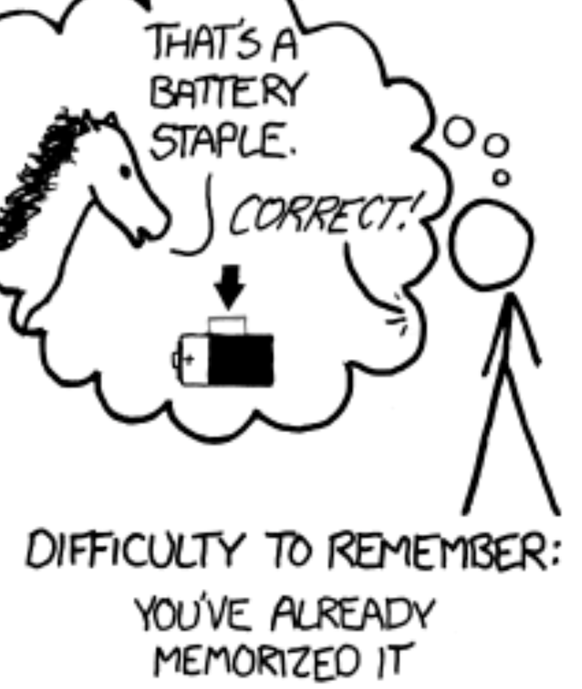

## ConUHacksVII_2023 🙌
: ConUHacksVII is the biggest annual hackthon in Quebec run by HackConcordia of Concordia University.

<h4>[ Duration ]🙋‍</h4>
- JAN 21, 2023 to JAN 22, 2023 (24 hrs)

 

<h4>[ Judges ]🙋‍</h4>
-<i> National Bank of Canada, Accenture, Nventive, CSE/CST, DRW, CAE, MLH, GSoft, Sun Life </i>

 
 

***

<h2>Team - Ssisters</h2>

| NAME | Github | LinkedIn |
| --- | --- | --- |
| Sarah Michelle Ang | https://github.com/yuzuryuu | https://www.linkedin.com/in/sarah-michelle-ang-8075a2206/ |
| Suin Kang | https://github.com/suinkangme | https://www.linkedin.com/in/suin-kang-b72b63203/ |
| Sooah Kil | https://github.com/sakil0518 | https://www.linkedin.com/in/sooah-kil-9a85a924b/ | 
| Hyunsoo Kim | https://github.com/Mikoos83 | https://www.linkedin.com/in/hyun-soo-kim-b41106224/ |

 

<h2>[ Repo ]</h4>
https://github.com/yuzuryuu/ConUHacksVII

 

***

 

## Challenge Question - RabbitBlackExicted23! 

This is the Challenge Question from CSE/CST as part of the 7th Edition of Concordia's ConUHacks.

<h3>Challenge</h3>
- SE is looking to for ways to help people make more secure passwords or better decisions about cybersecurity, such as a Web App to rate the security of a password, display how long it would likely take to crack the password, and allow the user to autogenerate passwords of multiple different formats. Winners  would be chosen based on ease of use, quality of suggestions, and innovative approaches to helping people make good decisions about their cybersecurity. Bonus points for making an app that can be run locally without internet access as well as an internet website. Similar tools already exist to the above one but the differentiator here would be generating many different formats of password and running offline.

<h3>💡Concepts💡</h3>
- This website is a generating strong secure password for user. The generated password is long enough but easy to remember. 

<h3>🎯Our solution🎯</h3>
- Good passwords need to meet two conditions: 1. it has to be long enough, 2. and it should be easy to remember. Our password generator 'RabbitBlackExcited23!' combine three different words, 2-digit numbers, and special character. First, to choose three words, the generator presents the photo of animal and the photo of color consecutively, then prompt a user to type in each word that corresponds the photos. By asking them input the word, it makes user be cognitively engaged to the words, which will lead to better password memorization. This also opens Next, they can pick one adjective word from the list. Only the words with longer or equal to length 5 were chosen to guarantee that the entire password be long enough. After users type in those words, they should put 2-digit numbers and add one special character.

 

<h4>Inspiration</h4>
- How can we make strong but memorable passwords? The combination of random letters like 'tNxOp3?' used to be suggested to create stronger passwords than weak ones such as 'qwerty123,' 'passwords456'... . However, not only have users hard time remembering them, but also the length has been pointed to be the most important factor. We are inspired by the presentation of CSE/CST, 'Making and Breaking Passwords,' and developed the tool that helps the user to create a secure password.

<h4>Challenges we ran into</h4>
- We want to make the strong password for user, but the password must be long to be secure. However, user will have a hard time to remember the password if it is too long. So, we need to think the easier way to memorize when we create comnbination of the the letters, digits, and special characters. 

<h4>Accomplishments that we're proud of</h4>
- First of all, we find the way how we can make the password as long as much possible. We decide to use image to user by giving strong impression to users. Also, for as long password as possible, animals, colours, and emotion with too short names were excluded in the list. We used to generated personal passwords only before, but we were glad that I learned how to create a strong password for users from the developer's point of view.

<h4>What we learned</h4> 
- We usually create and use passwords without considering security, but in fact, it turns out that our method of combining passwords is very vulnerable to security. By thinking about how passwords should be combined and created for secure, we learned which passwords are vulnerable to security and powerful. Also, we learned how to work with the team and communicate with each other.

<h4>What's next for RabbitBlackExicted23!</h4>
- After generating the password, it was shown directly to the user on the website, which is very vulnerable to security. We've also considered sending text files or emails without displaying the results right away, but this is also a bad security method. Accordingly, it is necessary to consider how to generate and send a password to the user, and how to save it in a database in case the user forgets it after generating the password, and to link it with an existing application that manages the password like 1password.

<h4>Devpost</h4>
https://devpost.com/software/rabbitblackexcited23
